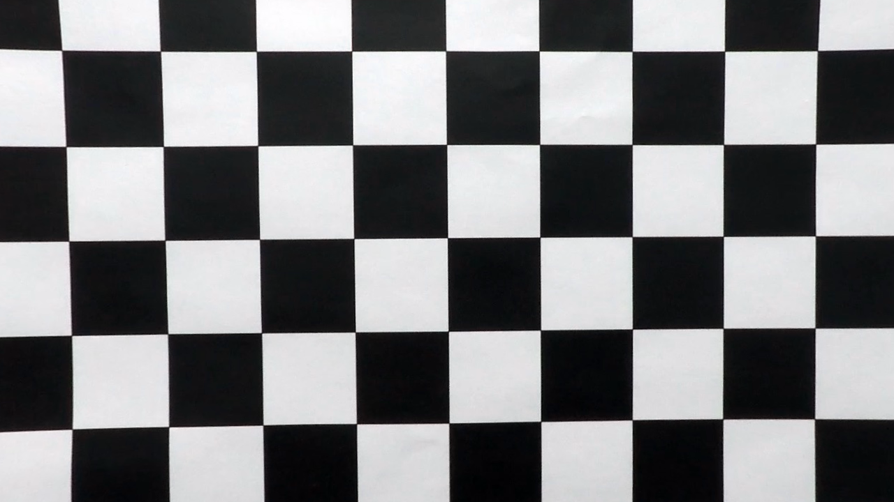
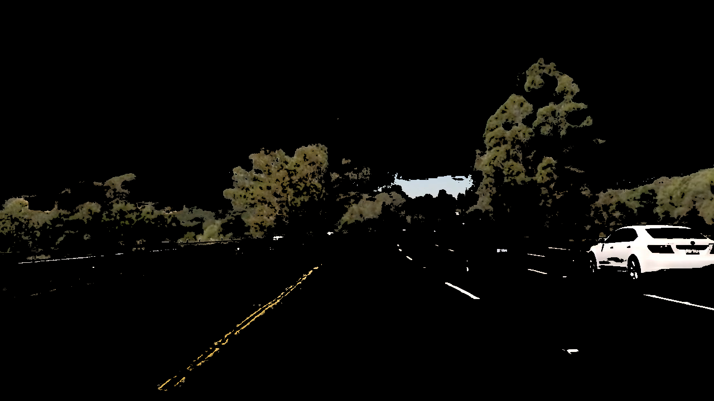
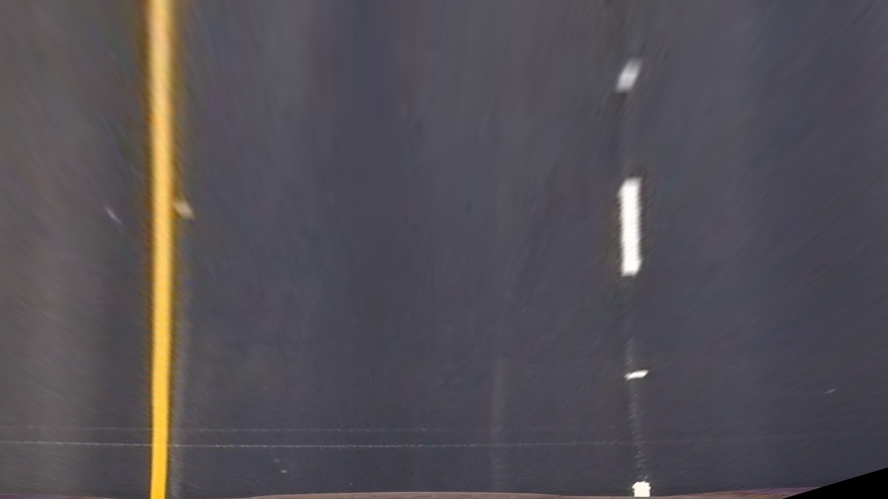
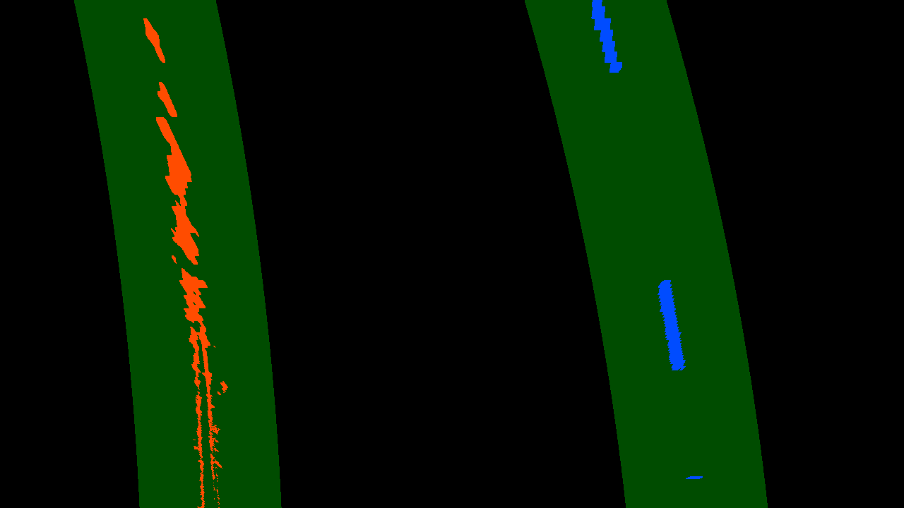
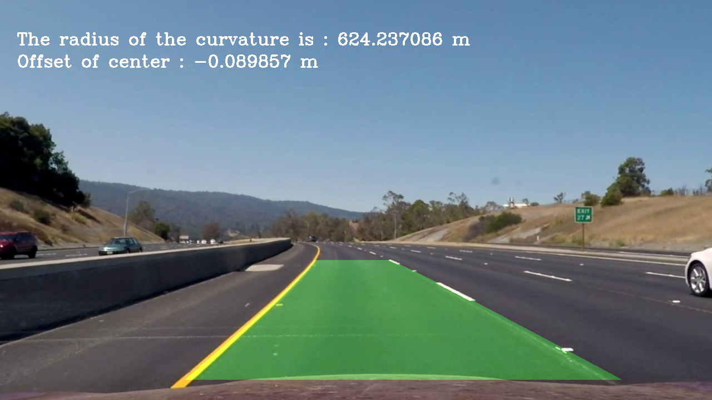

## Readme

---

**Advanced Lane Finding Project**

The goals / steps of this project are the following:

* Compute the camera calibration matrix and distortion coefficients given a set of chessboard images.
* Apply a distortion correction to raw images.
* Use color transforms, gradients, etc., to create a thresholded binary image.
* Apply a perspective transform to rectify binary image ("birds-eye view").
* Detect lane pixels and fit to find the lane boundary.
* Determine the curvature of the lane and vehicle position with respect to center.
* Warp the detected lane boundaries back onto the original image.
* Output visual display of the lane boundaries and numerical estimation of lane curvature and vehicle position.

[//]: # (Image References)

## [Rubric](https://review.udacity.com/#!/rubrics/571/view) Points

### Here I will consider the rubric points individually and describe how I addressed each point in my implementation.  

---

### README

All the codes are in Advanced_Lane_Line.ipynb.

## 1. Camera calibration

#### 1.1 Get the images for calibation and test

In this step, I read the chess board images in camera_cal folder to prepare for camera calibration.

#### 1.2 Compute calibration

I used the images and opencv function, mainly 'cv2.findChessboardCorners()' and 'cv2.calibrateCamera()' function to get the matrix used for calibration.

## 2. Undistortion

Here, I test the chess board image and image in test_images folder.
The following image is the test image after undistorted.

## 3. Color/gradient threshold

There are some features of lane line that can be used for lane line detection.
Here, I combined the color infomation and gradient to distiguish it from background. 
To reduce the light etc. effect, I used HLS color space and select the s channel.

## 4. Perspective transform

To get a bird view, I select the following source points and destination points to get the perspective transform matix.

src points are [718,468],[1046,684],[248,684],[568,468]

dst points are [920,0],  [920,720], [220,720],[220,0]

Then bird view image can be got.

## 5.Find the lines

Function 'fit_line()' are defined to find the line. In it, the histogram infomation for bird-view image are used, and also it can be as the base to for silde window search.

## 6. Calculate Curvature

After the line is find, use second order polynomial curve to fit the lane line, and the radius of the lane line (pixel space and real world space) can be calcualted.

## 7. Process Frame

In this step, a function that contained the methods in previous steps are defined, which used in the video processing.

The output video is 'test_videos_output/advanced_lane_line.mp4'

